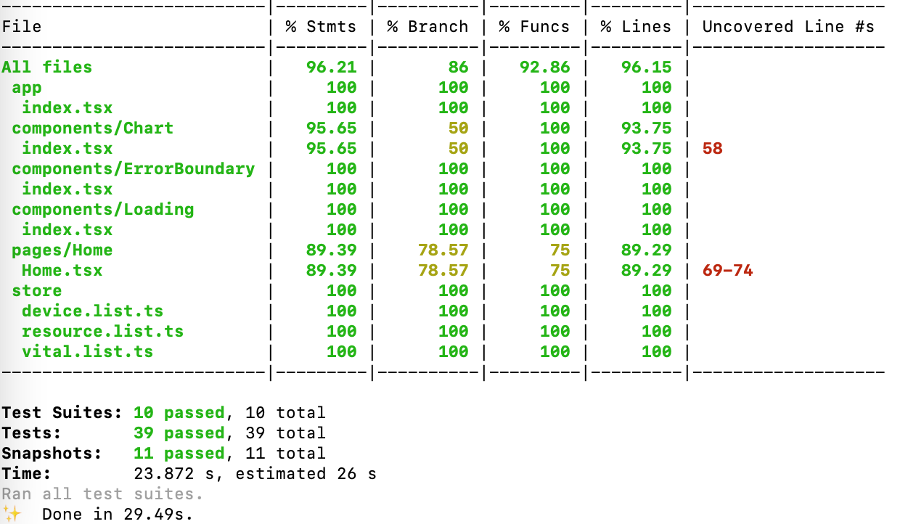

# perf-dashboard
performance metrics dashboard to display ttfb, fcp and other metrics' charts which are being collected using the [perf-lib](https://github.com/asimyildiz/perf-lib) that uses the backend [perf-service](https://github.com/asimyildiz/perf-service)

# links
See [changelog](./CHANGELOG.md) for current versions and feature plans.

# react template
[React-cool-starter](https://github.com/wellyshen/react-cool-starter) template is being used as boilerplate.
This boilerplate is selected because it is:
- Actively maintained
- Has built-in support for most of the necessary tech stack for this project
1. Has it's own server stack (express, helmet, hpp, compression), which will be dockerized and published to AWS App Runner
2. React.js as view library
3. Redux with Redux Toolkit and Redux Thunk for state management
4. TypeScript support
5. Webpack and babel for bundling and transpiling
6. eslint, stylelint, prettier, husky for clean-code
7. Jest, React Testing Library for tests
- Most of it's tech-stack is up-to-date
- a DIY (do-it-yourself) oriented starter kit

Other packages being used in this project are:
- [Charts.js React wrapper](https://github.com/reactchartjs/react-chartjs-2)
- [React-Bootstrap](https://github.com/react-bootstrap/react-bootstrap)

# usage
You just need to build and run the project after doing a clean installation:
> yarn
> yarn build
> yarn start

For development purposes, just run:
> yarn dev

# development packages
eslint, prettier is used for clean-code.
husky is used to push only the clean-code into git.
babel and webpack is being used to transpiling and building.

# commands
| `yarn <script>`  | Description                                                                        |
| ---------------- | ---------------------------------------------------------------------------------- |
| `dev`            | Runs your app on the development server at `localhost:3000`. HMR will be enabled.  |
| `dev:build`      | Bundles server-side files in development mode and put it to the `./public/server`. |
| `start`          | Runs your app on the production server only at `localhost:8888`.                   |
| `build`          | Bundles both server-side and client-side files.                                    |
| `build:server`   | Bundles server-side files in production mode and put it to the `./public/server`.  |
| `build:client`   | Bundles client-side files in production mode and put it to the `./public/assets`.  |
| `analyze:server` | Visualizes the bundle content of server-side.                                      |
| `analyze:client` | Visualizes the bundle content of client-side.                                      |
| `lint`           | Lints all `.tsx?`, `.jsx?` and `.scss` files.                                      |
| `lint:code`      | Lints all `.tsx?` and `.jsx?` files (With `--fix` to auto fix eslint errors).      |
| `lint:type`      | Runs type checking for `.tsx?` files.                                              |
| `lint:style`     | Lints all `.scss` files (With `--fix` to auto fix stylelint errors).               |
| `lint:format`    | Formats all files except the file list of `.prettierignore`.                       |
| `test`           | Runs testing.                                                                      |
| `test:watch`     | Runs an interactive test watcher.                                                  |
| `test:cov`       | Runs testing with code coverage reports.                                           |
| `test:update`    | Updates jest snapshot.                                                             |

# testing
You can run the tests by running the command:
> yarn test

Jest and React Testing Library is being used for testing the whole library.

# deployment
The application is deployed to AWS App Runner. You can of course use another provider that supports Docker images to deploy the application.
To deploy the application to AWS App Runner using a docker image, [AWS Copilot CLI](https://github.com/aws/copilot-cli) is used.
- To install AWS Copilot CLI on MacOS, run
> brew install aws/tap/copilot-cli

- !BE SURE THAT YOU ARE NOT USING YOUR ROOT ACCOUNT WHILE USING COPILOT CLI
- Please see the [documentation](https://github.com/aws/copilot-cli/blob/mainline/site/content/docs/credentials.en.md)
- Please create a new IAM admin user by following the tutorial [here](https://docs.aws.amazon.com/IAM/latest/UserGuide/getting-started_create-admin-group.html)
- Please create a named profile using AWS cli as described [here](https://docs.aws.amazon.com/cli/latest/userguide/cli-configure-profiles.html)

- Run aws configure with a new profile name :
> aws configure --profile profilename
- Enter your credentials of your new admin user
- Set default aws profile as profilename
> export AWS_PROFILE=profilename

- Steps to deploy application :
> copilot init
- Give your app a name      -> (perf-app)
- Select a workload type    -> (Load Balanced Web Service)
- Give your service a name  -> (perf-dashboard)
- Select dockerfile         -> ./Dockerfile
- Create a test env         -> N
> copilot env init
- Give this environment a name  -> prod
- Select credential to use      -> profilename
- Use default configurations
> copilot svc deploy

- After you deploy the application, App Runner will give you an url to access your application
- If you would like to use a custom domain name for this service, you need to have a domain name from a registrar (domain.com)
- You need to open page AWS Console->Services->Route 53 then navigate to "Hosted Zones"
- Then you need to press "Create hosted zone" (domain.com)
- You need to enter your domain name (domain.com) and leave other options as it is "Public Hosted Zone"
- After AWS created NS records for your domain, you need to copy them
- You need to navigate your domain name registrar's page and update NS records there with the ones that you have copied (you may need to remove transfer-lock if needed)
- In order to access your application with a custom domain name instead of the url that AWS provided
- You need to again open page AWS Console->Services->Route 53 then navigate to "Hosted Zones" and click on your hosted zone (domain.com)
- Then you need to click "Create Record" from the page that is opened
- You need to set your domain name from here (dashboard.domain.com), and select CNAME and enter the url AWS provided to value field
- After TTL time passes (like 5 mins), you can access your application via your custom domain name (dashboard.domain.com)

# CI/CD pipeline - AWS
The CI/CD pipeline will be created for the project using Copilot CLI which uses [AWS CodePipeline](https://aws.amazon.com/blogs/containers/enabling-continuous-workflows-for-aws-app-runner-service-with-persistency-using-aws-copilot-cli/). 
This will be the same as [perf-service](https://github.com/asimyildiz/perf-service).